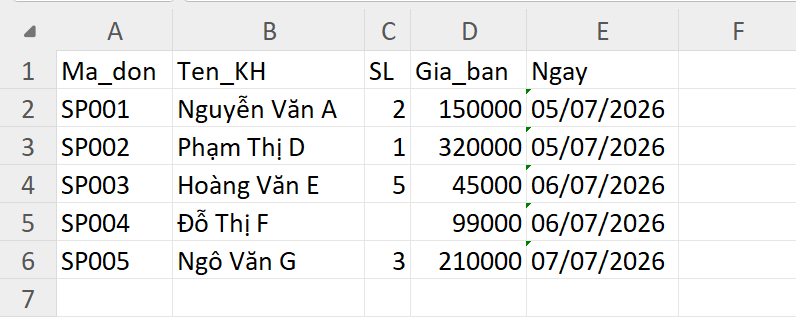
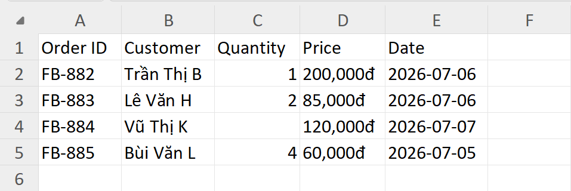
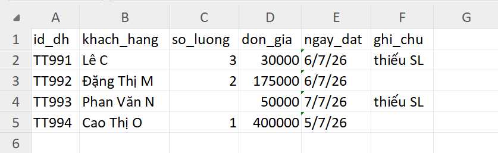
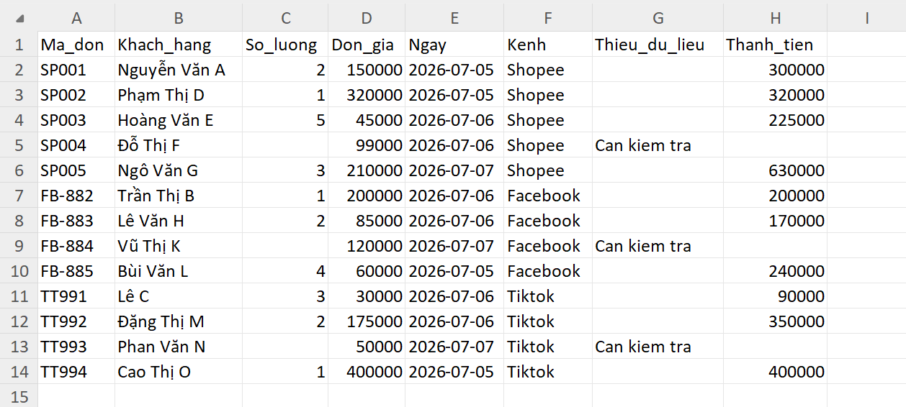
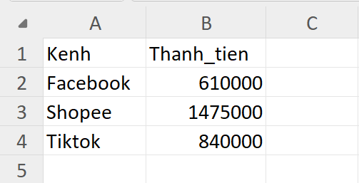

# Công Cụ Gộp & Làm Sạch Báo Cáo Doanh Thu Đa Kênh

Tự động gộp và làm sạch dữ liệu đơn hàng từ nhiều kênh bán hàng (Shopee, Facebook, TikTok Shop) thành **1 file báo cáo Excel thống nhất** — chỉ trong vài giây thay thủ công copy-paste mỗi tháng.

---

## 1. Vấn đề

Nếu bạn là chủ shop bán hàng trên nhiều kênh, mỗi tháng bạn phải tải về 3 file Excel đơn hàng từ Shopee, Facebook, TikTok Shop để tổng hợp doanh thu. Nhưng mỗi file lại có định dạng khác nhau:

- **Tên cột khác nhau hoàn toàn** giữa 3 kênh → không thể copy-paste gộp trực tiếp.
- **Định dạng ngày khác nhau**: `dd/mm/yyyy`, `yyyy-mm-dd`, `d/m/yy`.
- **Định dạng số khác nhau**: `"200,000đ"` là chữ (text), không phải số để tính toán được.
- **Dữ liệu thiếu**: có dòng bị trống số lượng, đơn giá...

Kết quả: mỗi tháng bạn mất **rất nhiều thời gian** để ngồi copy-paste tay để ra được một bảng doanh thu tổng hợp.

## 2. Giải pháp

Công cụ này đọc trực tiếp 3 file Excel gốc (không cần chỉnh sửa tay trước), tự động ánh xạ tên cột, chuẩn hóa định dạng ngày/số, đánh dấu các dòng thiếu dữ liệu, và xuất ra **1 file Excel duy nhất** gồm:

- Danh sách đơn hàng đã gộp & làm sạch, có thêm cột chú thích **tên kênh** (Shopee / Facebook / TikTok) để dễ theo dõi.
- Sheet tổng hợp doanh thu theo ngày / theo kênh.

**Kết quả bạn nhận được:** thay vì ngồi copy-paste thủ công mỗi tháng, bạn chỉ cần thả 3 file vào, chạy 1 lệnh, ra ngay file báo cáo sạch trong vài giây.

## 3. Tính năng (Features)

- Đọc dữ liệu từ nhiều nguồn (Shopee, Facebook, TikTok Shop) trong cùng một lần chạy.
- Ánh xạ (mapping) tên cột tự động từ định dạng riêng của từng kênh về một chuẩn thống nhất.
- Làm sạch định dạng tiền tệ (VD: `"200,000đ"` → số `200000`).
- Chuẩn hóa định dạng ngày tháng về cùng 1 chuẩn.
- Tự động đánh dấu các dòng thiếu dữ liệu để người dùng kiểm tra lại.
- Xuất báo cáo gồm 2 sheet: (1) dữ liệu đơn hàng đã gộp, (2) tổng hợp doanh thu theo ngày/kênh.

## 4. Cài đặt & Sử dụng

### Yêu cầu

- Python 3.8+

### Bước 1 — Cài thư viện

```bash
pip install -r requirements.txt
```

### Bước 2 — Chuẩn bị file dữ liệu

Đặt 3 file Excel tải về từ Shopee, Facebook, TikTok Shop vào cùng thư mục với script, đặt tên đúng như sau:

```
Shopee.xlsx
Facebook.xlsx
TikTok.xlsx
```

> ⚠️ *Phiên bản hiện tại yêu cầu tên file cố định như trên (xem mục Ghi chú/Giới hạn bên dưới).*

### Bước 3 — Chỉnh mapping cột (nếu tên cột trong file của bạn khác)

Mở file script, tìm phần khai báo mapping (đầu file), chỉnh lại tên cột cho đúng với file thực tế của bạn, ví dụ:

```python
# Tạo cột mẫu cho bảng shopee 
mapping_shopee = {
    "Ma_don": "Ma_don",
    "Ten_KH": "Khach_hang",
    "SL": "So_luong",
    "Gia_ban": "Don_gia",
    "Ngay": "Ngay",
}
# Tạo cột mẫu cho bảng facebook
mapping_facebook = {
    "Order ID": "Ma_don",
    "Customer": "Khach_hang",
    "Quantity": "So_luong",
    "Price": "Don_gia",
    "Date": "Ngay",
}
# Tạo cột mẫu cho bảng tiktok 
mapping_tiktok = {
    "id_dh": "Ma_don",
    "khach_hang": "Khach_hang",
    "so_luong": "So_luong",
    "don_gia": "Don_gia",
    "ngay_dat": "Ngay",
}
```

### Bước 4 — Chạy script

```bash
python main.py
```

Sau khi chạy xong, file báo cáo `bao_cao_tong_hop.xlsx` sẽ được tạo trong cùng thư mục.

## 5. Demo

### Trước khi gộp (dữ liệu gốc từ 3 kênh)

**Shopee**


**Facebook**


**TikTok**


### Sau khi gộp (file báo cáo thống nhất)

**SHEET 1 + SHEET 2**





## 6. Công nghệ sử dụng

- **Python**
- **pandas** — xử lý và làm sạch dữ liệu
- **openpyxl** — đọc/ghi file Excel

## 7. Ghi chú & Giới hạn

- Hiện tại tool dùng **tên file cố định** (`shopee.xlsx`, `facebook.xlsx`, `tiktok.xlsx`); phiên bản sau sẽ hỗ trợ tự động tìm file trong thư mục.
- Mapping tên cột hiện đang **cố định theo cấu hình có sẵn**; nếu kênh bán hàng muốn đổi tên cột trong file xuất, cần chỉnh lại `mapping_shopee, mapping_facebook và mapping_tiktok` trong script.
- Chưa hỗ trợ tự động phát hiện và gộp thêm các kênh bán hàng khác ngoài Shopee, Facebook, TikTok Shop.
- Hiện tại tool chỉ có thể xử lý chính xác dữ liệu dạng "200,000đ" --> 200000, như chưa xử lý được tất cả các trường hợp; phiên bản sau sẽ hỗ trợ xử lý toàn bộ các trường hợp có thể xảy ra trong file về dạng chuẩn.
